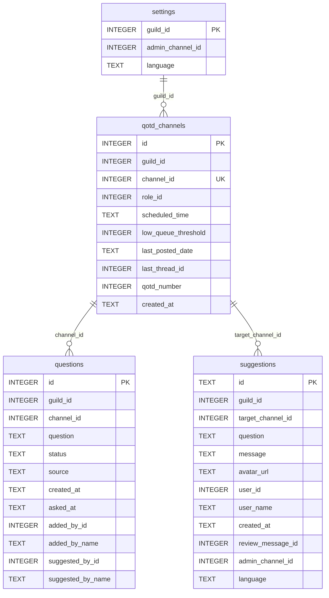

# QOTD Discord Bot — Full Feature List, Limits & Capabilities

A feature-rich, high-performance **Question of the Day (QOTD)** Discord bot built with **discord.py** and asynchronous **SQLite** (`aiosqlite`). It automates community engagement through scheduled daily questions, multi-channel independent scheduling, interactive control dashboards, community suggestion pipelines, contributor leaderboards, and native multi-language localization.

---

## 1. Executive Summary: What the Bot Does

The bot is designed to keep Discord communities active, talking, and engaged every day with zero maintenance friction:
- **Multi-Channel Architecture**: A single Discord server can run multiple independent QOTD channels (e.g., `#general-qotd`, `#gaming-qotd`, `#tech-qotd`), each with its own question queue, posting schedule, subscriber mention role, and history.
- **Automated Daily Posts**: Automatically selects a question from each channel's queue at its scheduled hour, publishes a polished embed with attribution, mentions a designated subscriber role, and creates an automated discussion thread.
- **Contextual Member Suggestions**: Community members can submit questions directly from daily posts (contextually bound to that channel), via `/qotd_suggest`, or through an interactive channel selection dropdown.
- **Admin Review Pipeline**: Suggestions can be reviewed in an interactive admin panel or directly via dynamic action cards posted to a private admin review channel, displaying the target channel and assigning it upon approval.
- **Interactive Control Dashboard**: Staff can manage queues per channel, switch channels via select menus, inspect history, edit entries, search questions, bulk-delete, and configure channels and settings via Discord buttons, select menus, and modals.
- **Smart Anti-Abuse & Limits**: Built-in queue caps, mailbox limits, per-user submission quotas, character limits, and channel-scoped duplicate detection prevent database bloat and spam.
- **Multi-Language Dual Localization**: Supports 7 languages with intelligent dual scoping: public posts use the server's language, while interactive private dashboards, ephemeral replies, modals, and direct messages adapt to each user's Discord client language.

---

## 2. Full Feature Breakdown: What the Bot Can Do

### A. Multi-Channel Daily Automated Publishing & Scheduler
- **Independent Channel Schedules**: Each configured QOTD channel has its own daily scheduled time (e.g., `09:00`, `14:30`, Europe/Prague timezone) and subscriber mention role.
- **Duplicate Day Prevention**: Tracks `last_posted_date` per channel in SQLite to ensure exactly one question is posted per channel per day even if the bot is restarted or reloaded.
- **Author Attribution**:
  - Highlights community members whose suggestions were accepted (`💡 Suggested by: @User`).
  - Highlights admins who manually added questions (`✍️ Added by: @Admin`).
  - Displays default system badge for seeded starter questions.
- **Automated Discussion Threads**: Spawns a dedicated public thread attached to the QOTD post so members can discuss without cluttering the main text channel. Automatically archives previous active threads when posting a new daily question.
- **Interactive Post Buttons**: Every daily post comes with two persistent interactive buttons:
  - `💡 Suggest Question`: Opens a submission modal automatically contextually bound to that channel.
  - `ℹ️ How it works`: Displays an ephemeral guide explaining the bot in the user's client language.
- **Per-Channel Low Queue Warning Alerts**: Automatically pings the staff admin channel when a channel's queue drops to or below its configured threshold (default: 3 questions remaining).

---

### B. Contextual Suggestion & Review Pipeline
- **Submission Routing Scenarios**:
  - **Scenario A (0 channels configured)**: Alerts user that no QOTD channels are currently set up.
  - **Scenario B (1 channel configured)**: Automatically routes the suggestion directly to that channel.
  - **Scenario C (Contextual post button)**: Clicking the button in an active QOTD channel automatically binds the suggestion to that channel without prompting.
  - **Scenario D (Ambiguous multi-channel)**: When `/qotd_suggest` is invoked outside an active QOTD channel on a multi-channel server without specifying a channel, an interactive `SuggestionChannelSelectView` dropdown prompts the user to select the destination channel.
- **Admin Review Channel Cards**:
  - When an admin channel is configured, suggestions generate an instant review embed card featuring submitter avatar, question text, submitter notes, target channel (`🎯 Target Channel: <#channel_id>`), and three dynamic action buttons:
    - `✅ Approve`: Atomically claims and approves the suggestion into the target channel's queue.
    - `✏️ Edit & Approve`: Opens a modal to refine/correct the question text before accepting.
    - `❌ Decline`: Opens a modal prompting for an optional rejection reason.
- **Asynchronous User Feedback DMs**:
  - When approved, the submitter receives an automated DM celebrating their question's acceptance and displaying the target channel name (`#channel-name`).
  - When declined, the submitter receives a polite DM explaining why (including the admin's feedback note, if provided) and the channel name.
  - **Submitter Language Preservation**: DMs are delivered in the submitter's language recorded at submission time, regardless of what language the reviewing admin or server uses.

---

### C. Interactive Admin Dashboard (`/qotd`)
Administrators with `Manage Server` or `Administrator` permissions can manage the entire bot through an interactive visual control panel:
- **📌 Questions in Queue (`to_ask`)**:
  - Channel switching dropdown: Seamlessly switch between configured QOTD channels.
  - Paginated list (10 questions per page) with page counters and queue metrics for the selected channel.
  - `➕ Add Question`: Opens a modal supporting single questions or bulk-pasting up to 50 questions at once into the selected channel.
  - `🔍 Search`: Search queue entries by keyword within the active channel.
  - `🗑️ Bulk Delete`: Interactive multi-select dropdown allowing admins to select and delete up to 10 questions simultaneously from the active channel.
  - `🧹 Clear Queue`: Two-step destructive confirmation dialog to wipe out the selected channel's queue safely without affecting other channels.
  - `Question Dropdown`: Selecting any question opens its dedicated **Question Detail Card**.
- **💡 Suggestions Mailbox (`suggestions`)**:
  - Paginated review queue displaying all pending member proposals and their target channels.
  - Inspect suggestion details and execute Approve, Edit & Approve, or Decline directly from the dashboard.
- **📜 Question History (`asked`)**:
  - Channel switching dropdown to view history for each specific channel.
  - Paginated log of previously posted questions with timestamps and attribution.
- **⚙️ Settings & Channel Management (`settings`)**:
  - **Live Statistics Overview**: Queue counts per channel, total database entries, pending suggestions count, and active channel list.
  - **Channel Management Interface**: Select any configured QOTD channel to adjust its schedule, subscriber mention role, low-queue threshold, or unlink it (`UnlinkChannelConfirmView`).
  - **Add QOTD Channel**: Interactive `AddQotdChannelSelectView` to bind and initialize new channels (auto-seeds 7 starter questions in the server's language).
  - **Admin Channel Selector**: Configure the private staff review channel.
  - **Language Selector**: Select server language with native flag emojis.
- **🏆 Leaderboard (`top`)**:
  - Displays top 10 community contributors whose suggestions were accepted into queues across the server.
- **ℹ️ Info & Guide (`info`)**:
  - Built-in operational manual explaining scheduling, permissions, and setup steps.

---

### D. Multi-Language System (7 Languages)
Full end-to-end internationalization with **245 translation keys** per language (1,715 translated strings total):
1. 🇬🇧 **English** (`en`, Default)
2. 🇨🇿 **Čeština** (`cs`)
3. 🇪🇸 **Español** (`es`)
4. 🇵🇹 **Português** (`pt`)
5. 🇸🇰 **Slovenčina** (`sk`)
6. 🇩🇪 **Deutsch** (`de`)
7. 🇫🇷 **Français** (`fr`)

#### Dual-Scope Routing:
| Scope | Target Language | Examples |
|---|---|---|
| **Private / Ephemeral** | User's Discord Client Language (`interaction.locale`) | Control panel (`/qotd`), channel switching menus, modals, ephemeral command responses (`/ping`, `/qotd_add`, etc.), suggestion submit confirmations, guide embeds, and asynchronous user DMs. |
| **Public / Server-Wide** | Server's Configured Language | Daily QOTD posts, discussion thread titles, admin review channel cards, public `/qotd_top` leaderboard, starter question seeding, low-queue alerts. |

*Fallback Hierarchy: User Client Language → Server Configured Language → English (`en`).*

---

## 3. Storage, Safety & Anti-Abuse Limits

To prevent database bloat, spamming, memory leaks, and malicious flooding, the bot enforces strict limits:

| Limit Name | Value | Purpose & Protection |
|---|---|---|
| **`MAX_QUEUE_QUESTIONS`** | **500 questions** | Maximum active questions in queue per channel. Prevents infinite backlog accumulation. |
| **`MAX_TOTAL_QUESTIONS`** | **2,500 questions** | Maximum lifetime questions (queue + history) per server. Safeguards database storage and query performance. |
| **`MAX_PENDING_SUGGESTIONS`** | **100 suggestions** | Maximum unreviewed suggestions in a server's mailbox. Protects against denial-of-service mailbox flooding. |
| **`MAX_USER_PENDING_SUGGESTIONS`** | **3 suggestions** | Maximum pending suggestions per individual member. Once staff reviews a user's suggestion, their slot is immediately freed. |
| **`MAX_QUESTION_LENGTH`** | **300 characters** | Maximum character length for any single question. Prevents embed layout breaking and overly long wall-of-text submissions. |
| **`MAX_BATCH_ADD_QUESTIONS`** | **50 questions** | Maximum questions that can be bulk-added in a single modal paste. Prevents rate-limit timeouts and oversized transactions. |
| **`MAX_FILE_UPLOAD_QUESTIONS`** | **500 questions** | Maximum questions allowed when bulk-uploading from a `.txt` file. |
| **`DEFAULT_LOW_QUEUE_THRESHOLD`** | **3 questions** | Alerts staff in the admin channel when a channel's active queue drops to or below this count. |

### Smart Duplicate Detection:
- **Normalization Algorithm**: Strips Markdown bullets (`-`, `*`, `•`), numeric prefixes (`1.`, `2)`), surrounding quotes, excess whitespace, and normalizes to lowercase.
- **Channel Scoped**: Duplicate checking is scoped to the target channel. The same question can be placed into separate channels (e.g., general vs. gaming) if desired, while intra-channel duplicates are rejected.
- **Cross-Checking**: Scans against active queue questions, asked history questions, and pending suggestions for that channel.

### Storage Footprint:
- SQLite database (`qotd.db`) operates in **WAL (Write-Ahead Logging)** mode with `aiosqlite` and `busy_timeout=5000`.
- Automatic column backfilling and migration safely convert legacy single-channel databases into the multi-channel schema on startup.
- A fully saturated server (multiple channels + 2,500 total questions + 100 suggestions + settings) consumes **less than 3 MB** of disk storage.

---

## 4. Full Command Reference

### Slash Commands (`/`)

| Command | Arguments | Permissions | Description |
|---|---|---|---|
| `/qotd` | `[section]` `[channel]` | Admin (`Manage Server`) | Opens the interactive QOTD control panel. Optional direct jump to section (`to_ask`, `suggestions`, `asked`, `settings`, `top`) and channel. |
| `/qotd_add` | `<question>` `[channel]` | Admin (`Manage Server`) | Adds a single question directly into the active queue of the specified channel (or active channel). |
| `/qotd_suggest` | `<question>` `[note]` `[channel]` | Everyone (`@everyone`) | Submits a question proposal for administrator review. Optional target channel; triggers interactive select menu if ambiguous. |
| `/qotd_send` | `[channel]` | Admin (`Manage Server`) | Immediately triggers publishing the next question from the queue into the specified channel. |
| `/qotd_top` | *None* | Everyone (`@everyone`) | Displays the public top 10 contributor leaderboard in the channel. |
| `/qotd_language` | `<language>` | Admin (`Manage Server`) | Sets the server's configured language. Choices: English, Czech, Spanish, Portuguese, Slovak, German, French. |
| `/ping` | *None* | Everyone (`@everyone`) | Replies with the bot's WebSocket gateway latency in milliseconds (localized to user). |

### Text Commands Prefix (`!`)

| Command | Arguments | Permissions | Description |
|---|---|---|---|
| `!hello` | *None* | Everyone (`@everyone`) | Friendly greeting in the channel using the server's configured language. |

---

## 5. Required Discord Bot Permissions

To operate without errors, ensure the bot's Discord role has the following permissions:

| Permission | Reason |
|---|---|
| **View Channels** (`view_channel`) | To see configured QOTD, review, and command channels. |
| **Send Messages** (`send_messages`) | To post daily questions, command responses, and staff alerts. |
| **Embed Links** (`embed_links`) | To render rich embeds for daily questions, control panels, cards, and leaderboards. |
| **Attach Files** (`attach_files`) | Optional; for embeds and media handling. |
| **Read Message History** (`read_message_history`) | To update and manage persistent review cards and discussion threads. |
| **Create Public Threads** (`create_public_threads`) | To create automated discussion threads on daily question posts. |
| **Send Messages in Threads** (`send_messages_in_threads`) | To participate in and initialize discussion threads. |
| **Mention @everyone, @here, and All Roles** (`mention_roles`) | To ping the configured subscriber role when posting daily questions. |
| **Use External Emojis** (`use_external_emojis`) | To render flag emojis and custom UI indicators. |

*Required User Permission for Admin Commands: `Manage Server` (`manage_guild=True`) or `Administrator`.*

---

## 6. Database Schema & Architecture

SQLite database (`qotd.db`) with `PRAGMA journal_mode=WAL` and `PRAGMA busy_timeout=5000`:

- **`settings` table**: Stores server-wide preferences (admin review channel, server language).
- **`qotd_channels` table**: Stores independent channel schedules, subscriber roles, queue thresholds, last posted dates, and thread tracking.
- **`questions` table**: Stores queued (`to_ask`) and historical (`asked`) questions scoped to `channel_id`. Indexed on `(guild_id, status)`, `(guild_id, channel_id, status)`, and `(guild_id, source, suggested_by_id)`.
- **`suggestions` table**: Stores pending member suggestions, target channel ID, admin review message IDs, submitter notes, and recorded user locales.
- **Starter Seeding**: Whenever a new QOTD channel is registered, 7 starter questions in the server's language are automatically seeded into that channel's queue.
- **Discord Channel Deletion Sync**: If a Discord channel configured as a QOTD channel is deleted from the server, the bot's `on_guild_channel_delete` listener automatically unlinks it from `qotd_channels`.

---

## 7. Quick Start Guide for Server Administrators

1. **Invite the bot** with the required permissions listed above.
2. Run `/qotd` and navigate to **⚙️ Settings & Stats**:
   - Click **➕ Add Channel** to register one or more QOTD channels.
   - Click on any configured channel to customize its **Posting Time**, **Notification Role**, or **Low Queue Alert Threshold**.
   - Set the **Admin Channel** to receive real-time suggestion review cards and low-queue alerts.
   - Set the **Server Language**.
3. Add questions to a channel's queue:
   - Use `/qotd_add <question> [channel]` to add questions directly, or
   - Go to `/qotd` → **📌 Questions in Queue** → select channel → **➕ Add Question** to bulk-paste questions.
4. Encourage members to propose questions using `/qotd_suggest` or by clicking the **"💡 Suggest Question"** button on daily posts.
5. (Optional) Run `/qotd_send [channel]` at any time to test-post the first question immediately into a channel.
